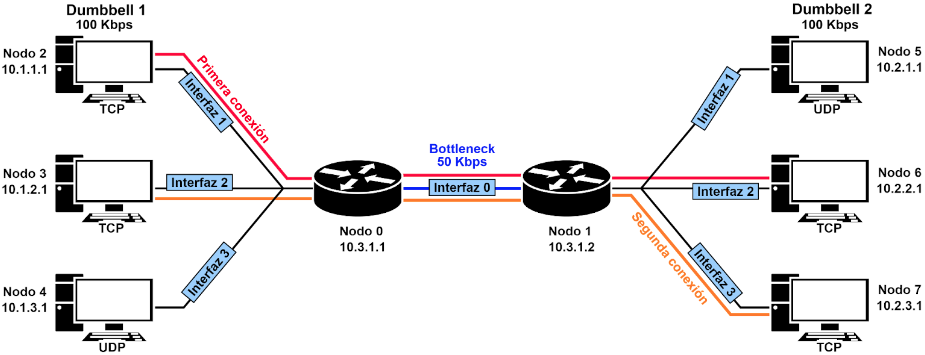

# Sistemas Operativos y Redes II

## <u>Trabajo Práctico Redes</u>

El objetivo del siguiente proyecto es realizar un análisis de redes, a partir de un escenario con una topología <b>Dumbbell</b> y conexiones cableadas.

Para ello tenemos 3 emisores on/off application (dos TCP y uno UDP), 3 receptores (misma distribución que los emisores) y dos routers intermedios.




// TODO replace for PDF file
Click [aquí](https://docs.google.com/document/d/118H7zzC6IB35fwhY8eYI8OZd9WQDBzqXHoMFdrMMRQM/edit) para ver el informe completo.


#### Comandos para la correcta ejecución del proyecto

```sh
    //TODO replace name
    ./waf --run scratch/elnombre 
```


- Introducción del tp
- Explicar qué hace cada archivo
- Cómo buildear
- Cómo eliminar
- Cómo generar la imagen con gnuplot
